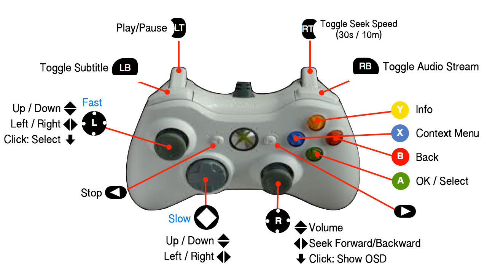

# Bridge between Kodi and Xbox 360 Controller

Kodi *should* support the Xbox 360 Wireless Controller, the emphasis is on *should*. After sinking two hours in trying to get it working I found out that root privileges are need. I don't think running Kodi as root is a good idea so I made this NodeJs script. It communicates with the wireless receiver and controls Kodi using the JSON RPC API. It's a hack, it's not pretty but it works reliable. I added a upstart script to start/stop the NodeJs script with Kodi. Adapt the path in it to reflect the location of `index.js`. Make sure you also have an upstart script named Kodi. If you are missing some features or want to change the layout go ahead, it should be quite easy.

